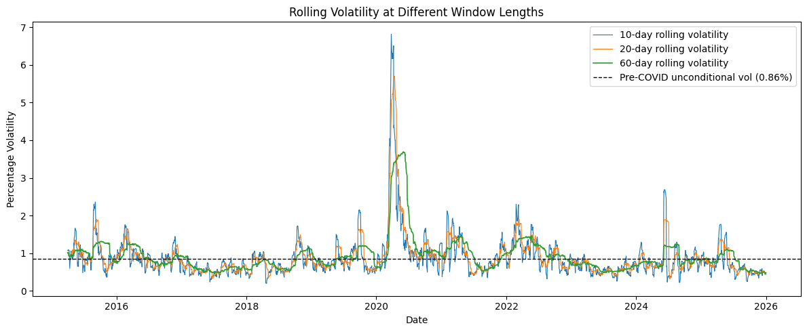

# Rolling_Standard_Deviation
Computing and observing rolling standard deviations of NIFTY 50 Close prices over a decade with rolling periods of 10, 20 and 60 days. Visual and calculation emphasis is put on the COVID-19 period and its effect on price volatilty.

## Overview
NIFTY 50 closing prices over 11 years from 2015 - 2026 are plotted to observe the general price trend over the selected period. Rolling standard deviations (volatilities) are calculated for each day over three periods, 10, 20, and 60 days, with a visual focus on the COVID-19 crisis period.

## Data
Closing prices of the NIFTY 50 Index are downloaded using the Yahoo Finance API (ticker: ^NSEI) from 01-01-2015 to 01-01-2026.

## Methodology
Firstly, log returns are calculated for the closing prices utilizing formula:
  log_return_t = 100 * log_natural(price_t/price_t-1). 
Once again log returns are utilized due to their additive effect and symmetry. Symmetry allows return to original price level in price reversal scenarios.

## Key Findings
As observed and expected in the pre-COVID period, all rolling volatilities remain stable with no drastic changes 

