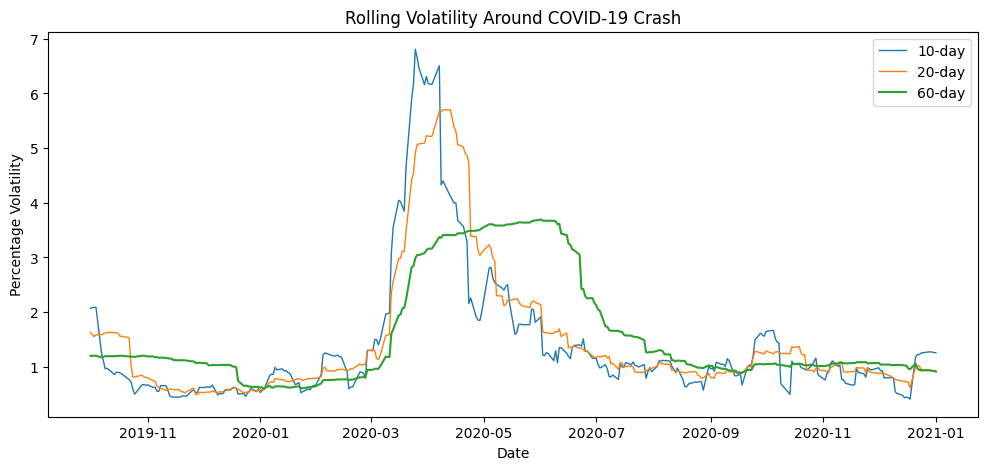
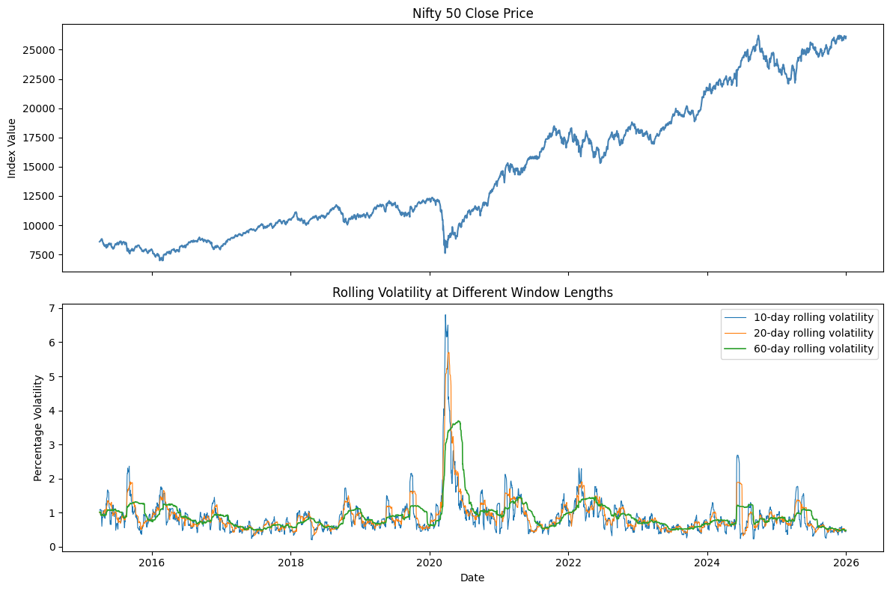

# Rolling_Standard_Deviation
Computing and observing rolling standard deviations of NIFTY 50 Close prices over a decade with rolling periods of 10, 20 and 60 days. Visual and calculation emphasis is put on the COVID-19 period and its effect on price volatilty.

## Overview
NIFTY 50 closing prices over 11 years from 2015 - 2026 are plotted to observe the general price trend over the selected period. Rolling standard deviations (volatilities) are calculated for each day over three periods, 10, 20, and 60 days, with a visual focus on the COVID-19 crisis period. By rolling, it is meant that standard deviations are calculated for a day by taking the log returns of the previous 10,20, or 60 days and calculating the SD. Next day, the selected window shifts forward by one day and the oldest day is removed and the newest one is added.

## Data
Closing prices of the NIFTY 50 Index are downloaded using the Yahoo Finance API (ticker: ^NSEI) from 01-01-2015 to 01-01-2026.

## Methodology
Firstly, log returns are calculated for the closing prices utilizing formula:
  log_return_t = 100 * log_natural(price_t/price_t-1). 
Once again log returns are utilized due to their additive effect ahnd symmetry. Symmetry allows return to original price level in price reversal scenarios. A price move from 100 points to 110 points and then back to 100 points is represented by the same magnitude of opposite sign.

## Key Findings
As observed and expected in the pre-COVID period, all rolling volatilities remain stable with no drastic changes when compared to the mean standard deviation of the entire pre-COVID period. However, during the pandemic all rolling volatilities are seen to spike with ten-day rolling SD rising tp 6.8 percent, twenty-day to 5.7 percent, and the sixty-day rolling SD rising to nearly 4 percent. Since SDs calculated over larger periods are averaged over more days, the rise is less steep.

Taking a closer look at the volatility changes during the pandemic, the rally is clearly visible.

In terms of index value, a pre-COVID growth period can be seen with slight rises in value over from 2015 to 2019. This is followed by a drawdown with the approach of the COVID period. However, worth noting, is the post-COVID rally with sharper price increases after 2020. As seen:
.

## Requirements
numpy pandas matplotlib yfinance

